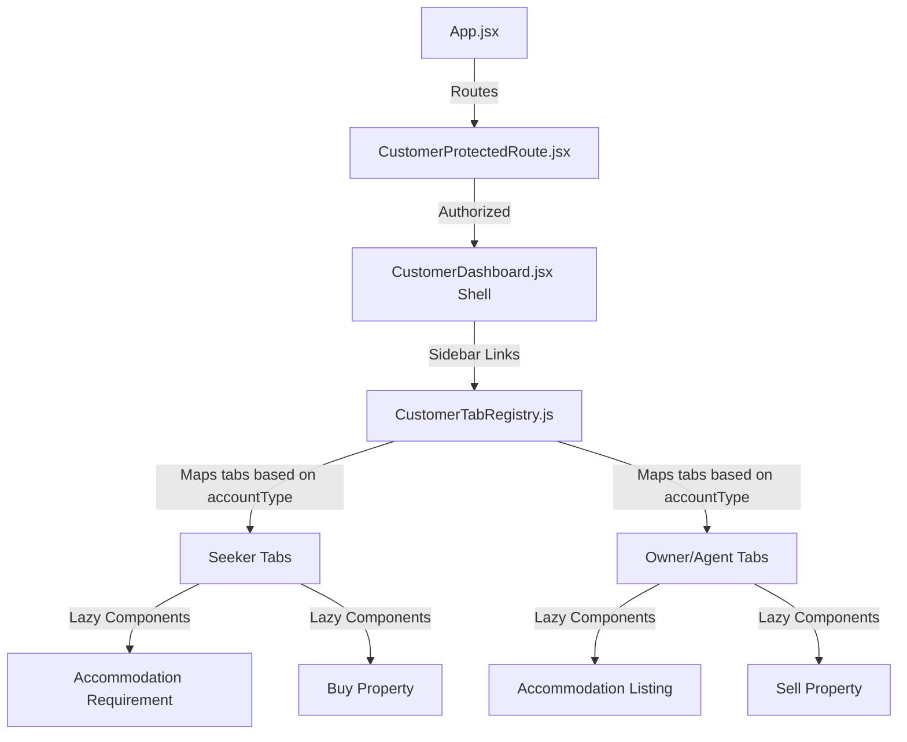

# Implementation Plan - Rebuilding Customer Dashboard Segment

This plan outlines the steps to restructure the Customer Dashboard into a dedicated dashboard segment mirroring the scalable, configuration-driven architecture of the existing Admin segment.

## User Review Required

> [!IMPORTANT]
> - **Route Re-organization**: All customer dashboard routes will be nested under `/customer/*` (e.g. `/customer/dashboard`), matching the admin pattern.
> - **Redux Bootstrapping**: A token refresh bootstrap for customer authentication will be added to `App.jsx` alongside the existing admin bootstrap to maintain customer sessions on page reload.

---

## Proposed Architectural Design

The new customer segment will be placed in a dedicated folder structure: `src/Components/Customer_Segment/`.



### Proposed Component Structure

```text
src/Components/Customer_Segment/
├── CustomerDashboard.jsx         (Layout shell: sidebar, topbar, content render, logout)
├── CustomerProtectedRoute.jsx    (Auth guard using customerAuth state)
├── CustomerTabRegistry.js        (Config registry mapping tab IDs to lazy components/icons)
├── CustomerRoles.js              (Role definitions: seeker, owner, agent permissions)
└── Tabs/                         (Subfolders containing specific dashboard tabs)
    ├── Inquiries/                (Render list of submitted inquiries)
    └── Profile/                  (User profile/settings tab)
```

---

## Proposed Changes

### 1. Customer Segment Component Files

#### [NEW] [CustomerProtectedRoute.jsx](file:///c:/Users/USET/Desktop/WORK/PROJECTS/Real-Estate-Project/realstate/src/Components/Customer_Segment/CustomerProtectedRoute.jsx)
- Checks `customerAuth.isAuthenticated`.
- Redirects to `/customer/login` if not authenticated.
- Renders `children` once authenticated.

#### [NEW] [CustomerRoles.js](file:///c:/Users/USET/Desktop/WORK/PROJECTS/Real-Estate-Project/realstate/src/Components/Customer_Segment/CustomerRoles.js)
- Maps account types (`seeker`, `owner`, `agent`) to their allowed tab IDs.
- Core Tabs:
  - `"my-inquiries"`: Viewing submitted inquiries (all roles).
  - `"accommodation_requirement"`: Form submission (seekers).
  - `"buy_property"`: Form submission (seekers).
  - `"accommodation_listing"`: Form submission (owners/agents).
  - `"sell_property"`: Form submission (owners/agents).
  - `"profile"`: Profile management (all roles).

#### [NEW] [CustomerTabRegistry.js](file:///c:/Users/USET/Desktop/WORK/PROJECTS/Real-Estate-Project/realstate/src/Components/Customer_Segment/CustomerTabRegistry.js)
- Registry structure holding:
  - `id`: identifier matching the allowed forms/tabs.
  - `label`: Display text.
  - `icon`: SVG path or Lucide component.
  - `component`: Lazy loaded form/tab component.

#### [NEW] [CustomerDashboard.jsx](file:///c:/Users/USET/Desktop/WORK/PROJECTS/Real-Estate-Project/realstate/src/Components/Customer_Segment/CustomerDashboard.jsx)
- The outer shell containing the responsive sidebar navigation and top header.
- Keeps sync with URL params (`?tab=...`) matching the admin dashboard pattern.
- Incorporates customer profile info and a clean logout button.

#### [DELETE] [CustomerDashboard.jsx](file:///c:/Users/USET/Desktop/WORK/PROJECTS/Real-Estate-Project/realstate/src/Components/WebPages/CustomerDashboard/CustomerDashboard.jsx)
- Remove the old simplified flat dashboard dashboard file.

---

### 2. Main Entry Integration

#### [MODIFY] [App.jsx](file:///c:/Users/USET/Desktop/WORK/PROJECTS/Real-Estate-Project/realstate/src/App.jsx)
- Add a session bootstrapping check for customer authentication (`customerAuthApi`'s `/customer/auth/refresh-token` and `/customer/auth/me` on startup).
- Protect `/customer/dashboard` route with `<CustomerProtectedRoute>` rendering the new `<CustomerDashboard />` layout.

---

## Verification Plan

### Manual Verification
1. **Auth Guard Verification**: Attempt to navigate directly to `/customer/dashboard`. Verify it redirects to `/customer/login`.
2. **Session Persistence**: Login, refresh the page, and ensure the session is successfully restored via `refresh-token`.
3. **Role-based Tab Access**:
   - Sign in as a `Property Seeker` and verify only the Seeker forms (Accommodation Requirement, Buy Property) and "My Inquiries" show in the sidebar.
   - Sign in as a `Property Owner` or `Agent` and verify only the Owner forms (Accommodation Listing, Sell Property) and "My Inquiries" show in the sidebar.
4. **Navigation Integration**: Verify clicking sidebar items updates the URL query string (`?tab=...`) and dynamically switches the active component without a full page reload.
